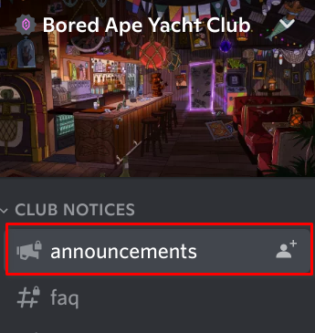
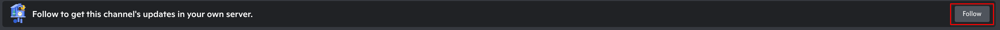
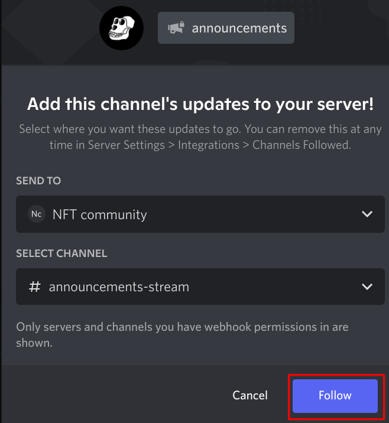
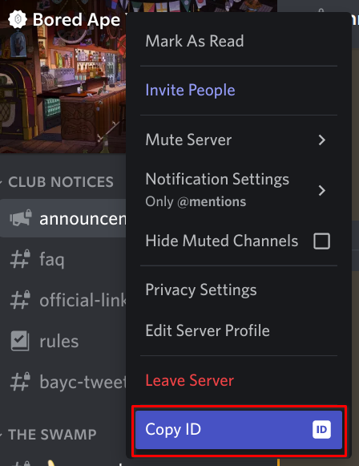

# social-data-listener

## installation
```
$ npm i
$ cp .env.example .env
```

## development
Start the CLI program and watch for changes:

`npm run watch`

## production
```
$ npm run build
$ npm start
```

## listeners
Overview of all available services in this repository.

### Discord
Listens to messages posted in up to 3 `#announcements` channels in a NFT collection's Discord server.

Unfortunately due to limitations imposed on the Discord API this process isn't 100% automatic.
Collection owners need to add our Discord bot to their server, copy and paste one verification command and finally specify the channels they would like to monitor.
The bot takes care of the rest.
This process is fairly seamless, but people are reluctant to add a random bot to their server.
Therefore, we also monitor the top NFT collection announcement channels semi-automatically to incentivize collection owners to get started with the discord integration.

#### Administration
To seed the database with some of the most important announcements from the top NFT collections, some manual steps are required. These steps assume that the bot has already been set up with a proper configuration and that you have the right permissions to execute admin commands. You only need to follow them once per NFT collection.

1. Join the NFT collection's discord server. Feel free to use an alt account. You can join a maximum of 100 servers per user account. 

2. Click the announcements channel and click on the 'follow' button.





3. Then, select Infinity's (moderation) Discord server and channel (the screenshot below is just an example).



4. Finally, go to the selected Discord server and type `/link <collection id/name/slug> <collection guild id>` to link the NFT collection to the discord server. You can get the guild id by enabling developer tools in discord settings, right clicking on the server name and clicking 'Copy ID'.



5. That's it! At this point all urgent announcements from the NFT collection will be sent to the selected Discord server and handled by the bot as long as they are linked.

### Twitter
Watches for tweets from all NFT collections using Twitter's [streaming API](https://developer.twitter.com/en/docs/twitter-api/tweets/filtered-stream/introduction).
This process is fully automatic and no manual intervention is required.

For now, only the `TWITTER_BEARER_TOKEN` environment variable is required to get it working.

### CoinMarketCap
Scrapes news articles from [CMC news](https://coinmarketcap.com/headlines/news/) every hour. These events are NOT linked to any NFT collections, they are just news items.
